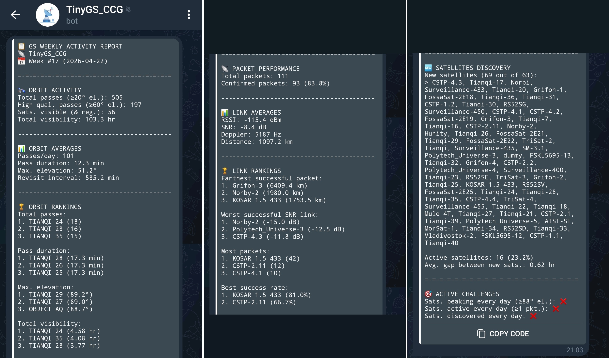
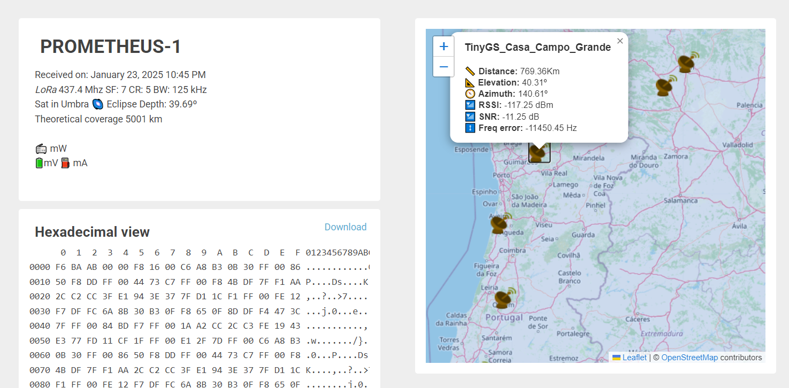

# TinyGS Performance Monitor

A Node-RED based analytics platform for [TinyGS](www.tinygs.com) devices, combining orbital predictions and network data to evaluate system performance and coverage. This system is complimentary to the dashboard provided by the network on their website. 

Developed in a Debian (Raspberry Pi) machine with simple code. Inspired by [Csongor Vargas](https://www.youtube.com/watch?v=jwsSpdWuTwk&t). Setup guide [here](src/setup.md).

^ Node-RED flow

^ Telegram performance report

### Features

- Orbit metrics (passes, visibility, revisit time)
- Packet performance (success rate, link quality)
- Satellite rankings (distance, elevation, activity)
- Discovery tracking (new satellites interaction)
- Consistency challenges (daily activity checks)

### Stack

- Node-RED (processing)
- InfluxDB 3 (storage)
- Grafana (visualization)
- Telegram (reporting)

 

## Ground station

This is my TinyGS hardware setup, built with AliExpress parts to reduce costs (~60€). Might improve RF parts quality to boost performance.

| Antenna | Station    | VNA    |
| ------------- | ------------- | ------------- |
|  |   |  |
| 433MHz 50Ω +3dBi omnidirectional | 230Vac → 12Vdc [LNA +20dB] → 5Vdc [LPF+LILYGO] | S11 -16dB @ 437MHz (end of chain) |

 

## Fun fact

I have managed to receive packets from a satellite that I helped building ([PROMETHEUS-1, the 1st Portuguese PocketQube](https://github.com/AFS-pt/PROMETHEUS-1)) with this ground station setup in my own home, with a staggering distance of more than 700 km!

 

## Future work

- Debug occasional error messages
- Verify statistical coherence
- Develop Grafana dashboard
- Integrate TinyGS API to gather packet contents (currently inaccessible)
- Add other statistics