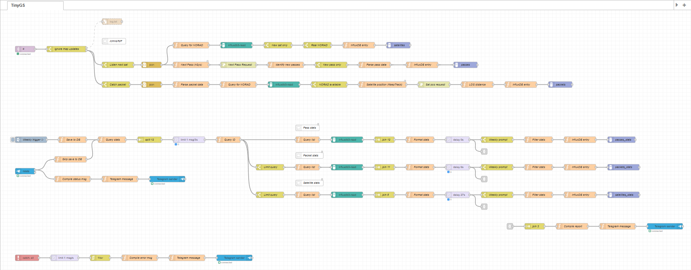
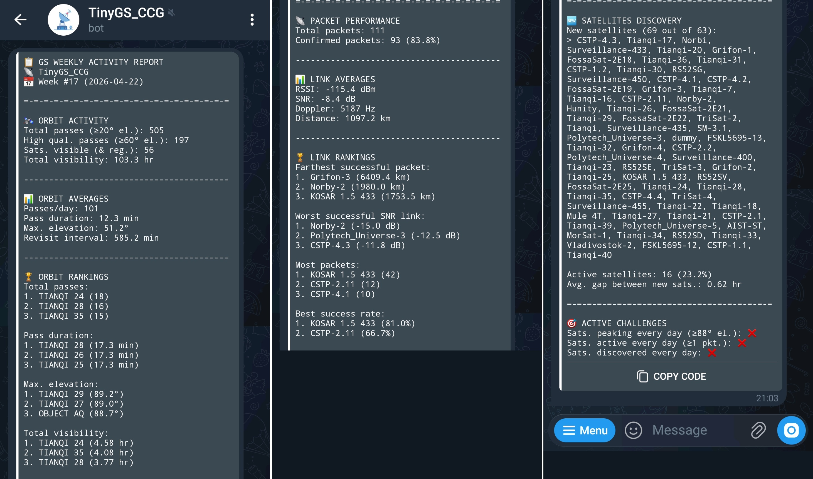

# TinyGS Performance Monitor

A Node-RED based analytics platform for [TinyGS](www.tinygs.com) devices, combining orbital predictions and network data to evaluate system performance and coverage. This system is complimentary to the dashboard provided by the network on their website. 

Developed in a Debian (Raspberry Pi) machine with simple code. Inspired by [Csongor Vargas](https://www.youtube.com/watch?v=jwsSpdWuTwk&t).


^ Node-RED flow


^ Telegram performance report

### Features

- Orbit metrics (passes, visibility, revisit time)
- Packet performance (success rate, link quality)
- Satellite rankings (distance, elevation, activity)
- Discovery tracking (new satellites interaction)
- Consistency challenges (daily activity checks)

### Stack

- Node-RED (processing)
- InfluxDB 3 (storage)
- Grafana (visualization)
- Telegram (reporting)


<br>

## Setup the InfluxDB 3 database

### Install InfluxDB 3
Based on the [official InfluxDB 3 Core tutorial](https://docs.influxdata.com/influxdb3/core/install/):

> 1. Run the following script on shell: 
> ```
> curl --silent --location -O https://repos.influxdata.com/influxdata-archive.key
> gpg --show-keys --with-fingerprint --with-colons ./influxdata-archive.key 2>&1 \
> | grep -q '^fpr:\+24C975CBA61A024EE1B631787C3D57159FC2F927:$' \
> && cat influxdata-archive.key \
> | gpg --dearmor \
> | sudo tee /usr/share/keyrings/influxdata-archive.gpg > /dev/null \
> && echo 'deb [signed-by=/usr/share/keyrings/influxdata-archive.gpg] https://repos.influxdata.com/debian stable main' \
> | sudo tee /etc/apt/sources.list.d/influxdata.list
> sudo apt-get update && sudo apt-get install influxdb3-core
> ```
> 
> 2. Increase the `query-file-limit` option on `~/etc/influxdb3/influxdb3-core.inf` to `3000` (this may add instability to the system but may be needed to query large data).
>
> 3. Set up the service autostart on boot with `sudo systemctl enable influxdb3-core`, which > should run on port `8181`. Logs can be seen with `sudo journalctl --unit influxdb3-core`.
>
> 4. Generate an API key token with `influxdb3 create token --admin` to have access and save it somewhere safe.

### Create the database and tables

1. Run the script below to create the required database structure. Modify the name of your database and your API key:
```
influxdb3 create database --token <YOUR_API_KEY> <YOUR_DB_NAME>

influxdb3 create table --token <YOUR_API_KEY> --database=<YOUR_DB_NAME> satellites

influxdb3 create table --token <YOUR_API_KEY> --database=<YOUR_DB_NAME> packets

influxdb3 create table --token <YOUR_API_KEY> --database=<YOUR_DB_NAME> passes

influxdb3 create table --token <YOUR_API_KEY> --database=<YOUR_DB_NAME> satellites_stats

influxdb3 create table --token <YOUR_API_KEY> --database=<YOUR_DB_NAME> packets_stats

influxdb3 create table --token <YOUR_API_KEY> --database=<YOUR_DB_NAME> passes_stats
```

### Improve debugging with InfluxDB Explorer

Optionally, InfluxDB Explorer can be installed to quickly manage any database and read/write data. 

First setup Docker with the [official Docker tutorial](https://docs.docker.com/engine/install/debian/#install-using-the-repository):

> 1. Remove conflicted packages with the following script:
> ```
> sudo apt remove $(dpkg --get-selections docker.io docker-compose docker-doc podman-docker containerd runc | cut -f1)
> ```
> 2. Set up the Docker's repository with:
> ```
> # Add Docker's official GPG key:
> sudo apt update
> sudo apt install ca-certificates curl
> sudo install -m 0755 -d /etc/apt/keyrings
> sudo curl -fsSL https://download.docker.com/linux/debian/gpg -o /etc/apt/keyrings/docker.asc
> sudo chmod a+r /etc/apt/keyrings/docker.asc
> 
> # Add the repository to Apt sources:
> sudo tee /etc/apt/sources.list.d/docker.sources <<EOF
> Types: deb
> URIs: https://download.docker.com/linux/debian
> Suites: $(. /etc/os-release && echo "$VERSION_CODENAME")
> Components: stable
> Architectures: $(dpkg --print-architecture)
> Signed-By: /etc/apt/keyrings/docker.asc
> EOF
> 
> sudo apt update
> ```
> 3. Install latest version with:
> ```
> sudo apt install docker-ce docker-ce-cli containerd.io docker-buildx-plugin docker-compose-plugin
> ```
>
> 4. Verify installation with:
> ```
> sudo docker run hello-world
> ```

Then, based on the [official InfluxDB Explorer tutorial](https://docs.influxdata.com/influxdb3/explorer/):

> 5. Pull the image and run with:
> ```
> # Pull the Docker image
> sudo docker pull influxdata/influxdb3-ui
> 
> # Run the Docker container
> sudo docker run --detach \
>   --name influxdb3-explorer \
>   --publish 8080:8080 \
>   --publish 8443:8443 \
>   influxdata/influxdb3-ui \
>   --mode=admin
> ```
> 6. Try to acess the service via browser over port `8888`.
> 
> 7. Configure your InfluxDB server URL with your IP and INfluxDB service port and API key token.
>
> 8. Your database should be accessible through the side bar.
>
> 9. Future service starting is done with:
> ```
> sudo docker start influxdb3-explorer
> ```

<br>

## Setup the Node-RED flow

### Install Node-RED and run a server

Based on the [official Node-RED tutorial](https://nodered.org/docs/getting-started/raspberrypi):

> 1. Run the following command on shell: 
> ```
> bash <(curl -sL https://github.com/node-red/linux-installers/releases/latest/download/update-nodejs-and-nodered-deb)
> ```
>
> 2. After installation, try to start the server:
> ```
> node-red start
> ```
> 
> 3. Generate a password hash and copy it:
> ```
> node-red admin hash-pw
> ```
> 
> 4. Open `~/.node-red/settings.js`, uncomment the `adminAuth` object and paste the hash on the `password` field.
> 
> 5. Set up the service autostart on boot with:
> ```
> sudo systemctl enable nodered.service
> ```
> 
> 6. Try to acess the service via browser over port `1880` with the usual username login.

### Setup the flow

1. Go to the sidebar options and import the provided `tinygs.json` flow.

2. A pop-up should appear to automatically install the following packages if missing: `node-red-contrib-telegrambot`, `node-red-contrib-influxdb3` and `node-red-contrib-influxdb3-read`.

3. Open the MQTT node, edit the TinyGS server settings, open the Security tab and insert your TinyGS MQTT credentials (obtained via [TinyGS Telegram bot](https://t.me/tinygs_personal_bot)).

4. If MQTT is not already connected, update the MQTT certificates uploaded to the node. To do so, go to [TinyGS GitHub repo](https://github.com/tinygs/tinyGS/blob/6dcbf47c45ac35bd3c2307113d12bdad42f415bd/tinyGS/src/certs.h), copy each certificate and paste into two separate files. Then, upload `newsroot.cert` as main certificate and `ISRGroot.cert` as CA certificate.

5. Verify if your InfluxDB API key is inserted in read and write nodes (either directly or by calling it environmentally).

6. Register in [N2YO](https://www.n2yo.com/login/edit/) and generate an API key. Repeat for [KeepTrack](https://keeptrack.space).

7. Create a [Telegram bot](https://t.me/BotFather) and generate an API key and a `/stats` command. Get you [Telegram user ID](https://t.me/myidbot).

8. Setup your global environmental variables and configurations based on your information (API keys, etc...) obtained above.

9. Done! You can inject the queries manually to verify if everything is working as expected.

<br>

## View data on Grafana

### Install and configure Grafana
Based on the [official Grafana tutorial](https://grafana.com/docs/grafana/latest/setup-grafana/installation/debian/):

> 1. Install the prerequisite packages with:
> ```
> sudo apt-get install -y apt-transport-https wget gnupg
> ```
> 
> 2. Import the GPG key with:
> ```
> sudo mkdir -p /etc/apt/keyrings
> sudo wget -O /etc/apt/keyrings/grafana.asc https://apt.grafana.com/gpg-full.key
> sudo chmod 644 /etc/apt/keyrings/grafana.asc
> ```
> 
> 3. Add the repository for stable releases with:
> ```
> echo "deb [signed-by=/etc/apt/keyrings/grafana.asc] https://apt.grafana.com stable main" | sudo tee -a /etc/apt/sources.list.d/grafana.list
> ```
> 
> 4. Install Grafana OSS with:
> ```
> sudo apt-get update
> sudo apt-get install grafana
> ```
>
> 5. Run the service with:
>
> ```
> sudo systemctl daemon-reload
> sudo systemctl start grafana-server
> ```
>
> 6. Try to acess the service via browser over port `3000`.
>
> 7. Login with user `admin` and password `admin`, and setup a new password. Username can also be changed on profile settings.

Configure the InfluxDB connection based on the [official InfluxDB tutorial](https://docs.influxdata.com/influxdb3/clustered/process-data/visualize/grafana/?t=InfluxQL):

> 8. Go to connections and add a new InfluxDB data source with the following parameters:
>    - Query language: InfluxQL
>    - URL: http://localhost:8181
>    - Database: \<YOUR_DB_NAME>
>    - User: \<YOUR_USERNAME>
>    - Password: \<YOUR_API_KEY>
>    - HTTP Method: GET

You are now able to create dashboards to display your preferred statistics!

## Future work

- Debug occasional error messages
- Verify statistical coherence
- Develop Grafana dashboard
- Integrate TinyGS API to gather packet contents (currently inaccessible)
- Add other statistics